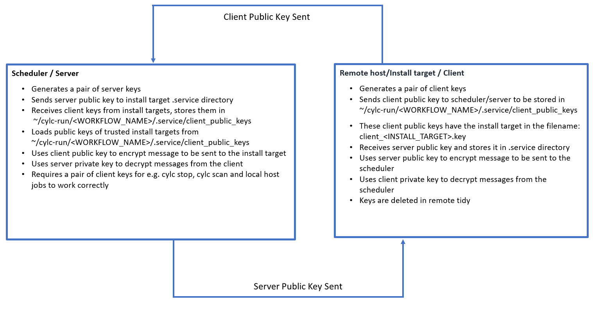

# CurveZMQ Authentication for Cylc8

The security aims of CURVEZMQ are documented
[here](http://curvezmq.org/page:read-the-docs#toc3).

### Use of CURVEZMQ in Cylc8

The scheduler has a permanent key pair, both generated[^1] in the .service
directory. A public key, named `server.key` and a private key, named
`server.key_secret`. These file extensions are chosen and expected by ZMQ.

Since commands such as `cylc scan` and `cylc stop` require the server to act as
a client, a set of ‘client’ keys are also needed on the scheduler, so, the
server keys are copied. The ‘client public key’ (named `client_localhost.key`)
for the server, is copied to the required client_public_keys directory which
is contained in the `.service` directory.
The ‘client private key’ (named `client.key_secret`) for the server remains in
the `.service` directory.  
Note that any time there are any changes to the `client_public_keys` directory,
we must run configure_curve to instruct ZMQ that there has been a change to
configuration.

We send the `server.key` to the client's `.service` directory, via rsync, once
remote initialisation has completed[^2]. The transfer of this key is logged in
the `file installation log` which can be found in the `log/suite/` directory.

Client keys are generated on a per `install target` basis. A permanent key pair
is generated[^3], in the `.service` directory on the install target. 
The client public key is then transferred back to the scheduler, piggy-backing
on the remote init return tag. 
The keys are then reloaded using configure_curve, ready for use.
In case of workflow shutdown, the keys held on the scheduler are deleted[^4].
Client held keys are deleted on `remote tidy`[^5].

### The role of transient keys
So far, the keys mentioned in this document have been "permanent" keys, all 
stored on disk and exist until the workflow is stopped, or, in the case of the
client, until the client is no longer required and `tidied`.  

There also exist short term `transient` keys that are created once the client
has the `server.key` transferred to it. These keys (four per connection) are 
generated by CurveZMQ and what follows is a handshake process. 

[This link to the documentation](http://curvezmq.org/page:read-the-docs#toc9)
describes the HELLO/WELCOME/INITIATE/READY handshaking process which happens on
each connection.

These transient keys are removed from memory by CURVEZMQ as soon as the
authentication process for the connection is complete.

## Diagram of Cylc8 Authentication 

[^1]: Code reference: cylc/flow/suite_files.py: create_server_keys()
[^2]: Code reference: cylc/flow/task_remote_mgr.py: _remote_init_callback()
[^3]: Code reference: cylc/flow/task_remote_cmd.py: create_client_keys()
[^4]: Code reference: cylc/flow/network/authentication.py: key_housekeeping()
[^5]: Code reference: cylc/flow/task_remote_cmd.py: remove_keys_on_client()